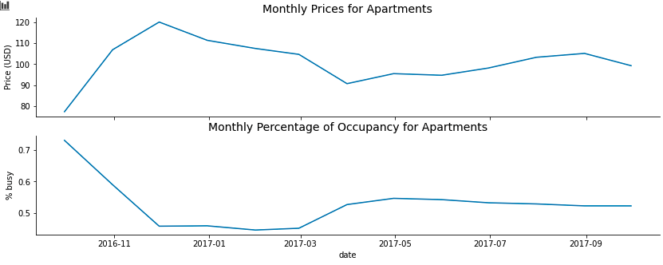
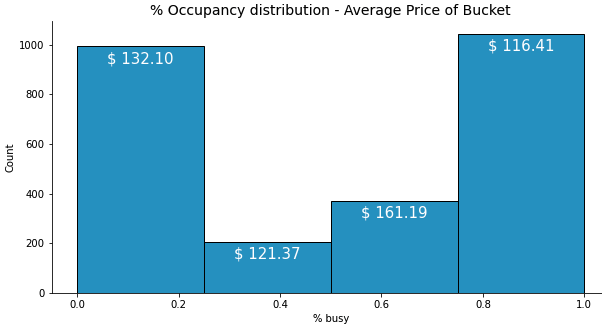
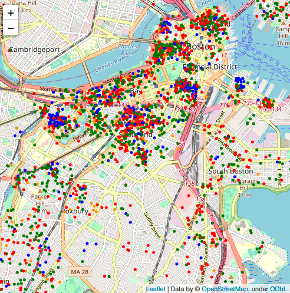

## Data mining Boston AirBnB data set using CRISP-DM process model

The CRoss Industry Standard Process for Data Mining (CRISP-DM) is a process model with six phases that naturally describes the data science life cycle. It’s like a set of guardrails to help you plan, organize, and implement your data science (or machine learning) project. [1]

In this project I will follow the CRISP-DM process model to analyze the Boston AirBnB data set to answer the following questions:

1. How is price impacting the occupancy of Apartments during the year?

1. What other factors may impact the selection of an apartment beisdes de price?

1. Do the physical location of the property has an impact on the occupancy of the property?

1. Model a price predictor based on some features of the listings data set

## Libraries used

To run the associated Jupyter Notebook please ensure your python environment contains the following libraries:

- folium
- matplotlib
- numpy
- pandas==1.2.3
- seaborn

## Boston AirBnB Data 

The Boston Airbnb data set consist of three different comma separated value files:

listings.csv, including full descriptions and average review score
calendar.csv, including listing id and the price and availability for that day
reviews.csv, including unique id for each reviewer and detailed comments

This analysis will use only the first two files, listings and calendar.

## Summary of the results of the analysis

It may seem obvious that at lower pricess the occupancy will be higer and indeed that was the case, but that also means that in general Boston as a City have very similar places all around the city so there is not a clear differentiator beside the price to help to choose a place.
In the below image it can be see how the occupancy is highly correlated to the average price. Any sudden change in the price drives the occupancy up or down.

Dividing the price in four different price groups, and plotting each group in the map, show that there is not a clear cluster of places, and low and high prices are mixed all around the city.

Price Distribution | Price group mapping
------------------ | -------------------
 | 

After working on the amenities to include them as features to be used in the price predictor, the following features were used

features|coefficients|p_values
--------|------------|--------
accommodates|5.00|0.00
bathrooms|7.95|0.00
Cable TV|16.67|0.00
Hair Dryer|0.96|0.00
Essentials|1.28|0.00
Dryer|4.26|0.00
Washer|10.56|0.00
Family/Kid Friendly|2.78|0.00
Heating|-3.52|0.00
Kitchen|-17.95|0.00
Air Conditioning|17.42|0.00
Internet|0.68|0.00
TV|15.24|0.00
bed_type_Real Bed|3.96|0.00
bed_type_Pull-out Sofa|-10.84|0.00
bed_type_Futon|-31.49|0.00
room_type_Shared room|-83.98|0.00
room_type_Private room|-75.83|0.00
guests_included|2.74|0.00
beds|-2.89|0.00
bedrooms|21.81|0.00
24-Hour Check-in|-5.80|0.00

## License

The content of this repository is licensed under a [Creative Commons Attribution License](http://creativecommons.org/licenses/by/3.0/us/)

[1]: CRISP-DM. (2021, July 31). Data Science Process Alliance. https://www.datascience-pm.com/crisp-dm-2/

